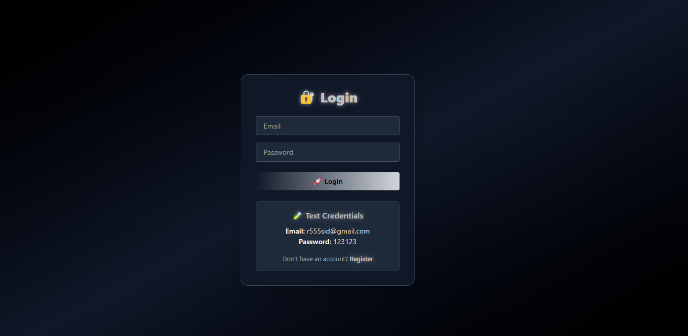
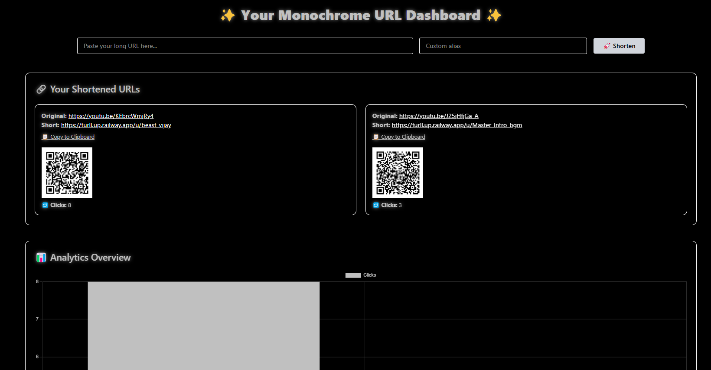
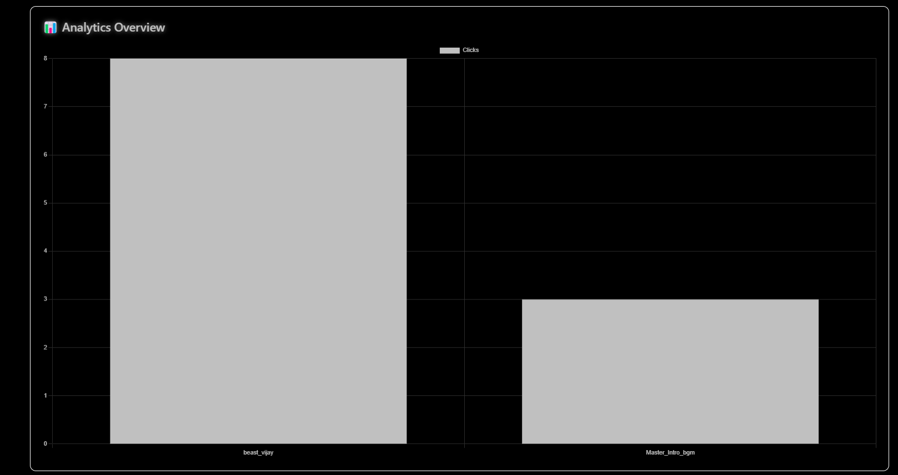

# ✨ Tiny URL , a URL Shortener Dashboard

A modern, minimalistic full-stack URL shortener and analytics platform.  
Users can shorten long URLs, create custom aliases, generate QR codes, and view analytics in a beautiful dashboard interface.

---

## 🚀 Demo

Frontend: https://tiny-url-ochre.vercel.app/ 

Backend Test URL:
1. https://turll.up.railway.app/ on Railway for higher performance 🚀.
2. https://tinyurl-backend-i7ia.onrender.com/ on Render .

Refer https://github.com/isid555/TinyUrl-Backend for backend server code !

---

## 🧠 Tech Stack

### 🌐 Frontend
- **React.js** – [React](https://reactjs.org/)
- **Tailwind CSS** – [Tailwind](https://tailwindcss.com/)
- **Framer Motion** (for animations) – [Framer Motion](https://www.framer.com/motion/)
- **Chart.js + react-chartjs-2** (for analytics) – [Chart.js](https://www.chartjs.org/)
- **qrcode.react** (QR code generation) – [QRCode.react](https://github.com/zpao/qrcode.react)
- **Lucide React** (icons) – [Lucide](https://lucide.dev/)

### 🔧 Backend
- **Node.js & Express.js** – REST API
- **MongoDB** – Persistent storage for URL mappings and click tracking
- **JWT Auth** – Secure authentication
- **Deployed on Railway and Render**

---

## 📦 Features

- 🔗 Shorten any long URL instantly
- 📝 Optional custom alias (e.g., ` https://turll.up.railway.app/u/Master_Intro_bgm`)
- 📈 Analytics dashboard with click stats
- 📊 Bar chart visualization for clicks
- 📎 Copy-to-clipboard functionality
- 📷 Built-in QR code for each short link
- 🔐 Secure user-based URL history (JWT auth)
- 💻 Clean, dark, minimal UI with motion animations

---

---

## 📸 Screenshots

### 1. 🔐 Login Page
Login using pre-built test credentials (JWT-based auth).  

---

### 2. 📊 Dashboard
Fully responsive dashboard showing shortened links, QR codes, and click analytics.  

 

---

## 🤝 Contributing

Built with patience, pixels, and purpose. If you found this project helpful, consider leaving a ⭐ — it means a lot!

